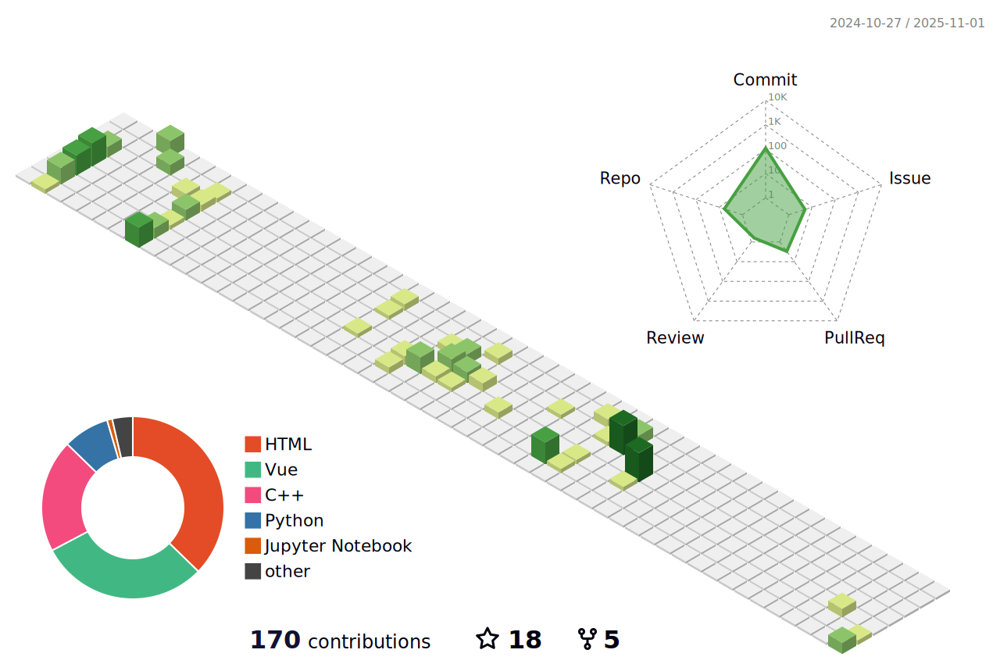

## 武汉大学 - 陈宏宇   Wuhan University - Chen Hongyu
00 后      山西省实验中学      WHU      物理竞赛      计算机科学专业

### 关于我

我是陈宏宇

某知名视频站的不知名 [UP 主](https://space.bilibili.com/501072171)

在山西省实验中学度过最美好的高中三年

就读于武汉大学计算机专业

热衷钻研与计算机有关的一切：

前端开发、平面设计、影片制作、游戏建模...

白日梦想：

带着相机和好心情 与喜欢的人环游世界

请多指教！

   

### Github 活跃度

<!--   GitHub stats graph -->
### 📈 GitHub Activity Graph:

<!--   green snake -->

<!--   stats + languages -->
| .                                                                                                                                       | .                                                                                                                         |
|-----------------------------------------------------------------------------------------------------------------------------------------|---------------------------------------------------------------------------------------------------------------------------|
|  |  |

</img>

<!-- dark snake -->

<!--   profile-green-animate -->

<!--   grid-snake  -->

<!--   skyline 

-->

<!--  TOP codersrank для обновления картинки нужно обновить профиль на странице https://profile.codersrank.io/user/bepb-->

</img>
<!--  2d history skills для обновления картинки нужно обновить профиль на странице https://profile.codersrank.io/user/bepb-->
</img>

